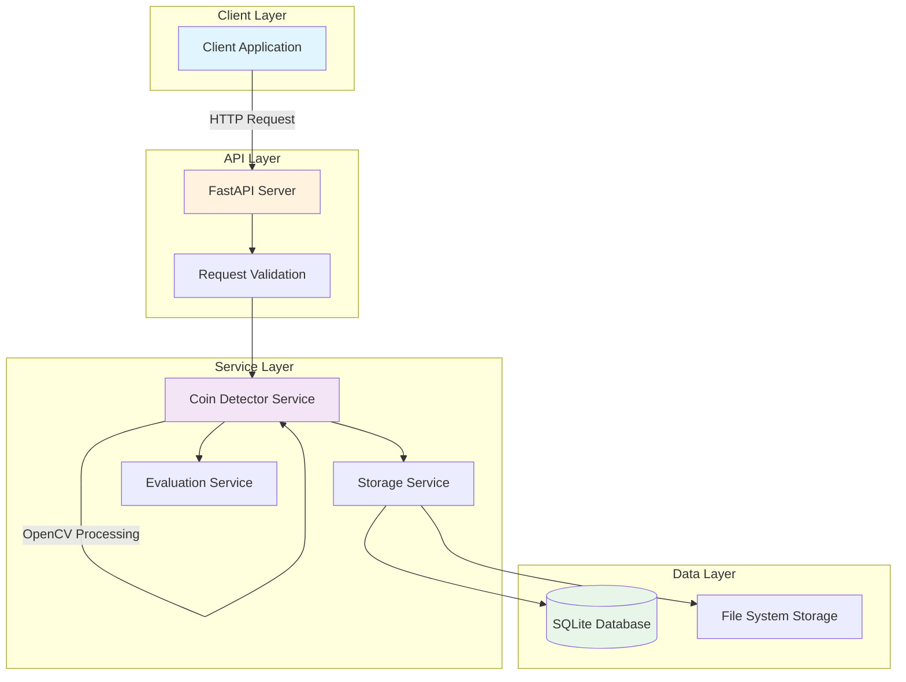
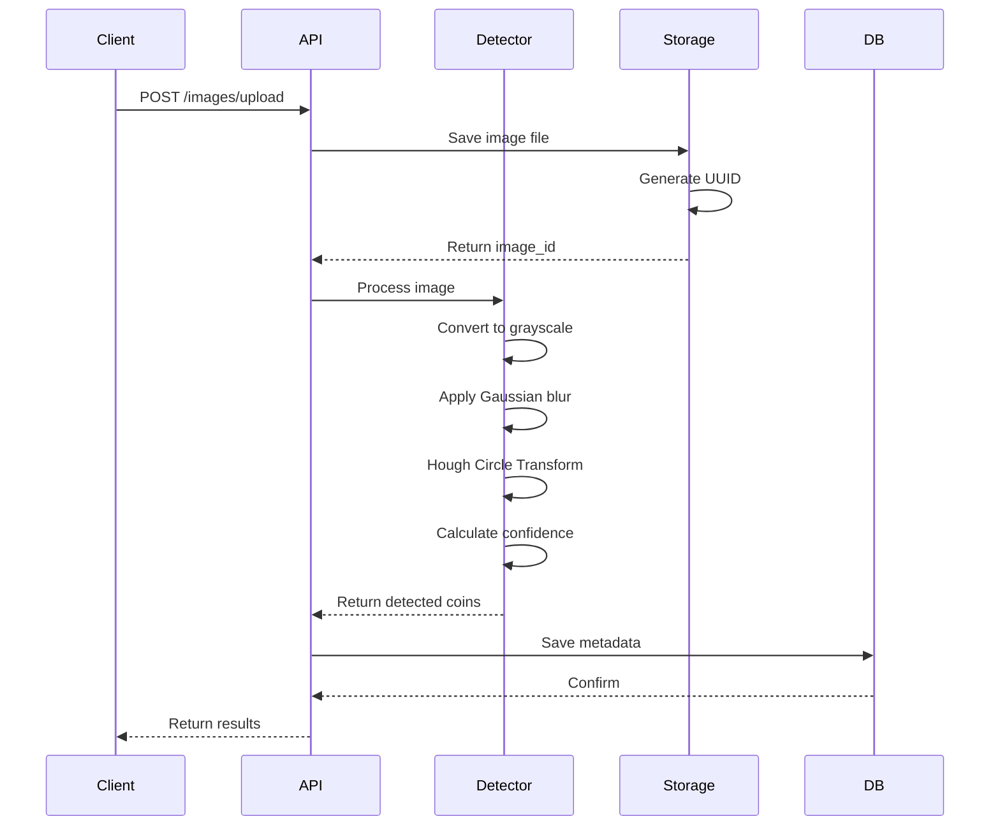

# Challenge 1: Coin Detection API

REST API for detecting circular objects (coins) in images using computer vision YOLOv8.

## Architecture



### Detection Pipeline



### Why Move Beyond Hough Circles?

- **Textured backgrounds** (wood, fabric) cause false positives
- **Parameter sensitivity** leads to inconsistent results
- **No learning capability**—unable to improve with more data

### Our Solution: YOLOv8 with Transfer Learning

- Direct use of professional COCO annotations for 191 images
- **Skip manual labeling**—hours saved
- **Transfer learning** on pre-trained YOLOv8
- **Actual data**: 152 images for training, 39 for validation

## Project Structure

```
challenge1/
├── app/
│   ├── api/
│   │   └── endpoints.py      # FastAPI endpoints
│   ├── models/
│   │   ├── database.py       # SQLite models
│   │   └── schemas.py        # Pydantic schemas
│   ├── services/
│   │   ├── coin_detector.py     # Fallback Hough detector
│   │   ├── yolo_detector.py     # Trained YOLOv8 detector
│   │   ├── storage.py           # Image storage service
│   │   ├── convert_coco_to_yolo.py  # Annotation converter
│   │   └── evaluation.py        # Model evaluation metrics
│   └── main.py               # Application entry
├── storage/
│   └── images/               # Image storage with COCO annotations
├── train_yolo.py             # Model training script
└── requirements.txt
```

## Setup & Training

### 1. Install Dependencies

```bash
pip install -r requirements.txt
```

### 2. Train the Model

```bash
python -m app.train_yolo
```

- Converts COCO annotations → YOLO format
- Splits data: 70% train, 30% validation
- Trains YOLOv8s for 100 epochs
- Saves best model as `coin_model_final.pt`

### 3. Run the API

```bash
uvicorn app.main:app --reload --port 8000
```

## 📡 API Usage

**Upload Image & Detect Coins**

```bash
curl -X POST "http://localhost:8000/api/v1/images/upload" \
  -F "file=@your_coin_image.jpg"
```

**Response Example**

```json
{
  "image_id": "uuid",
  "filename": "your_coin_image.jpg",
  "coin_count": 4,
  "coins": [
    {
      "id": "coin-uuid",
      "centroid": [x, y],
      "radius": 45,
      "bounding_box": [x, y, width, height],
      "confidence": 0.92
    }
  ],
  "processing_time_ms": 125.3,
  "message": "Detected 4 coins"
}
```

> **Note:** If you test on a training image, you’ll get a warning about data leakage.

***

## Testing

Run unit tests:
```bash
pytest tests/ -v --cov=app --cov-report=html
```

## Tech Stack

| Component   | Technology     | Why We Chose It                                  |
|:-----------:|:--------------|:-------------------------------------------------|
| Framework   | FastAPI        | Async support, auto-documentation, type safety   |
| Detection   | YOLOv8         | State-of-the-art, fast, accurate                 |
| Database    | SQLite         | Zero config, fits project scale                  |
| Storage     | File System    | Simple, direct access to images                  |
| Training    | Ultralytics    | Best YOLO implementation                         |


## Implementation Details

### Data Pipeline

- **COCO → YOLO conversion**: `convert_coco_to_yolo.py`
    - Parses COCO JSON bounding boxes
    - Normalizes coordinates
    - Splits train/validation

- **Training**: `train_yolo.py`
    - YOLOv8s transfer learning
    - Early stopping (patience=20)
    - Best model selection (validation mAP)

- **Inference**: `yolo_detector.py`
    - Confidence threshold: 0.25
    - IoU threshold: 0.45
    - Data leakage detection

### Database Schema

- **Images** table: Metadata storage
- **Coins** table: Detection results (linked to images)


## 🚨 Data Leakage Protection

Detects usage of training images and outputs a warning:

```json
{
  "message": "Detected 5 coins  WARNING: This image was in the training set!"
}
```

