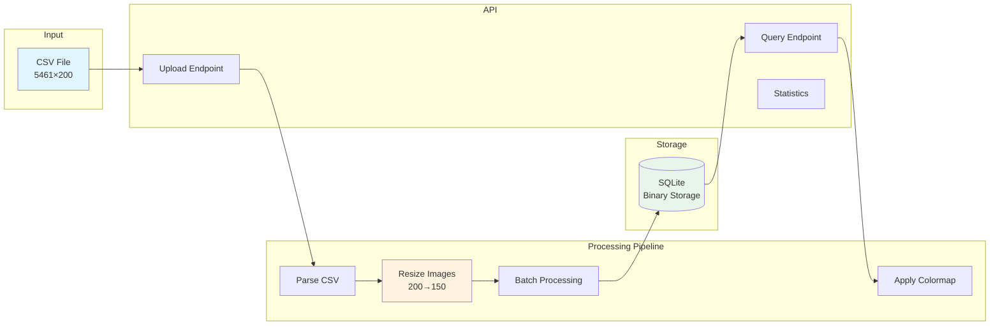
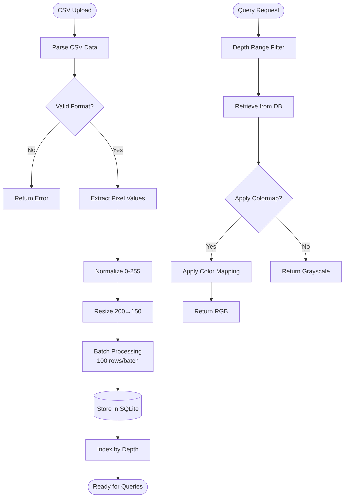

# Challenge 2: Image Processing Pipeline

A high-performance API for processing CSV-based image data with resizing and colormap application capabilities.

## 🎯 Overview

This solution processes large CSV files containing image data (5461 rows × 200 columns), resizes each row from 200 to 150 pixels using linear interpolation, stores the data efficiently in SQLite, and provides fast retrieval with optional colormap application.

## 🏗️ Architecture



### Data Flow



## 🚀 Quick Start

### Using Docker

```bash
# Build and run
docker-compose up --build

# API will be available at http://localhost:8001
# Swagger docs at http://localhost:8001/docs
```

### Local Development

```bash
# Create virtual environment
python -m venv venv
source venv/bin/activate
# Install dependencies
pip install -r requirements.txt
# Run application
uvicorn app.main:app --reload --port 8001
```

## 📡 API Endpoints

1. **Upload CSV**  
   - Endpoint: `POST /api/v1/upload-csv`  
   - Content-Type: `multipart/form-data`  
   - Processing: Resizes and stores image data  

2. **Get Frames by Depth**  
   - Endpoint: `GET /api/v1/frames`  
   - Parameters:  
     - `depth_min`: Minimum depth value  
     - `depth_max`: Maximum depth value  
     - `colormap`: Optional (viridis, jet, hot, etc.)  

3. **Get Statistics**  
   - Endpoint: `GET /api/v1/frames/statistics`  
   - Response: Total frames, depth range, storage size  

4. **Available Colormaps**  
   - Endpoint: `GET /api/v1/colormaps`  
   - Response: List of available colormaps  

## 🧪 Testing

Run unit tests:
```bash
pytest tests/ -v --cov=app --cov-report=html
```

## 📊 Performance Metrics

- Processing Speed: 10–20 rows/ms
- Total Storage: ~800KB for 5461 frames
- Query Speed: < 50ms for range queries
- Batch Size: 100 rows (optimal)

## 🎨 Available Colormaps

- viridis, jet, hot, cool, hsv
- rainbow, plasma, inferno, magma, twilight

## 🛠️ Technology Stack

- FastAPI 0.104.1
- Pandas 2.1.3, NumPy 1.24.3
- OpenCV 4.8.1
- SQLite
- Uvicorn

## 📁 Project Structure

```
challenge2/
├── app/
│   ├── api/          # API endpoints
│   ├── core/         # Configuration
│   ├── models/       # Database models
│   ├── services/     # Processing logic
│   └── main.py       # Application entry
├── tests/            # Unit tests
├── requirements.txt  # Dependencies
└── docker-compose.yml
```
