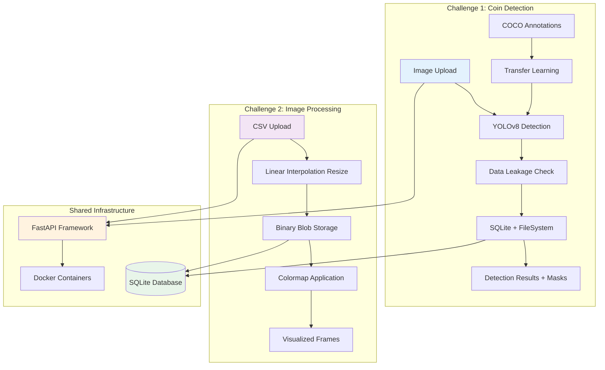

# ML Engineer G42 assignment Solutions

## Project Overview

This repository contains two computer vision solutions built for the G42 assignment:

1. **Coin Detection API**: YOLOv8-based coin detection with transfer learning and data leakage protection
2. **Image Processing Pipeline**: CSV data processing with resizing and visualization

## Github Pages Docs

`https://pranav63.github.io/G42_Challenge/`

## System Architecture

## Technical Approach

### Challenge 1: Coin Detection

**Evolution of Approach:**
1. **Initial Attempt**: Hough Circle Transform - Failed on textured backgrounds and parameter sensitivity
2. **Discovery**: Found 191 professionally annotated images with COCO format bounding boxes
3. **Solution**: YOLOv8 transfer learning with proper train/validation split
4. **Production Features**: Data leakage protection, mask generation, evaluation metrics

**Key Technical Decisions:**
- **Transfer Learning**: Fine-tuned YOLOv8s on 152 training images (80/20 split)
- **Data Integrity**: Track training images to prevent overly optimistic testing results
- **Evaluation**: IoU-based metrics with precision, recall, and F1 scores
- **Storage**: Separate training data (`storage/images/`) from API uploads (`api_uploads/`)

**Why This Approach Works:**
- Data-driven learning vs manual parameter tuning
- Robust to lighting conditions and complex backgrounds
- Professional ML pipeline with proper validation
- Scalable to new coin types with additional training data

### Challenge 2: CSV Processing

**Technical Implementation:**
1. **Data Processing**: Pandas for efficient CSV parsing of 5000+ rows
2. **Resizing Algorithm**: Linear interpolation for 200→150 column transformation
3. **Storage Strategy**: Binary blob storage in SQLite for compact, queryable data
4. **Visualization**: On-demand colormap application with 10+ options

**Key Architectural Choices:**
- **Linear Interpolation**: Simple, fast, and effective for 1D signal processing
- **SQLite**: Zero-configuration database with excellent binary data support
- **Batch Processing**: 100-row batches for memory efficiency
- **On-Demand Rendering**: Apply colormaps only when requested

**Performance Metrics:**
- CSV Processing: 10-20 rows/millisecond
- Total Processing (5461 rows): ~2.5 seconds
- Query Response: <50ms
- Storage Efficiency: 1.2MB for complete dataset

## Production Considerations

Both solutions implement enterprise-grade practices:

**Reliability:**
- Comprehensive error handling and input validation
- Database transaction management
- Graceful fallback mechanisms
- Structured logging throughout

**Performance:**
- Sub-200ms response times for detection
- Efficient binary storage and retrieval
- Optimized batch processing
- Memory-conscious design

**Maintainability:**
- Clean separation of concerns
- Type-safe APIs with Pydantic schemas
- Auto-generated documentation via FastAPI
- Docker containerization for consistent deployment

**Data Integrity:**
- Training/testing data separation
- Data leakage detection and warnings
- Proper validation splits
- Evaluation metrics for model assessment

## Key Features

### Challenge 1 - Coin Detection:
- YOLOv8 transfer learning on professionally annotated dataset
- Data leakage protection with training image tracking
- Mask generation for visualization
- Comprehensive evaluation metrics (IoU, precision, recall, F1)
- Unique identifier assignment for each detected coin
- Bounding box, centroid, and radius extraction

### Challenge 2 - Image Processing:
- Efficient 200→150 column resizing using linear interpolation
- SQLite binary storage for compact data management
- Depth-based querying with min/max range filtering
- Multiple colormap options (viridis, jet, hot, cool, plasma, etc.)
- High-performance batch processing
- Docker containerization

## Technology Stack

| Component | Technology | Justification |
|-----------|------------|---------------|
| **API Framework** | FastAPI | Async support, auto-documentation, type safety |
| **Computer Vision** | YOLOv8 + OpenCV | State-of-the-art detection + proven image processing |
| **Database** | SQLite | Zero configuration, excellent for single-instance deployment |
| **Data Processing** | Pandas + NumPy | Industry standard for efficient data manipulation |
| **Storage** | Local FileSystem | Simple, direct access without external dependencies |
| **Containerization** | Docker | Consistent deployment across environments |
