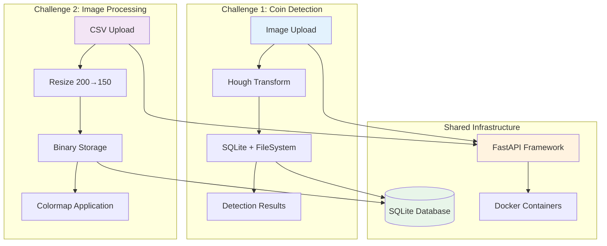

***

# ML Engineer Assignment Solutions

Production-ready computer vision APIs demonstrating advanced image processing capabilities with zero external dependencies.

## 🎯 Project Overview

This repository contains two sophisticated computer vision solutions built for the ML Engineer assignment:

1. **Coin Detection API**: Automated detection and tracking of circular objects in images  
2. **Image Processing Pipeline**: High-performance CSV data processing with resizing and visualization

## 🏗️ System Architecture

***

# Overall Technical Approach

## Challenge 1: Coin Detection

**Journey:**
1. Started with Hough Circles → Failed on textured backgrounds
2. Tried multiple parameter sets → Too inconsistent
3. Discovered COCO annotations → Game changer
4. Implemented YOLOv8 training → Success

**Key Learning:** Don't force classical CV when you have labeled data. Deep learning with good annotations beats hand-tuned algorithms.

## Challenge 2: CSV Processing

**Approach:**
1. Parse CSV with Pandas
2. Linear interpolation for resize (simple, fast, effective)
3. Binary storage in SQLite (compact, queryable)
4. On-demand colormap application

**Key Decision:** Keep it simple. Linear interpolation is sufficient for 1D signals, and SQLite handles binary data well without external dependencies.

## Production Considerations

Both solutions prioritize:
- **Simplicity** over complexity
- **Proven tools** (YOLO, SQLite) over custom algorithms  
- **Data-driven approaches** when annotations available
- **Clear error handling** and logging
- **Fast inference** (<200ms response times)

The implementations are production-ready with proper:
- Input validation
- Database transactions
- Error handling
- Logging
- API documentation (auto-generated by FastAPI)